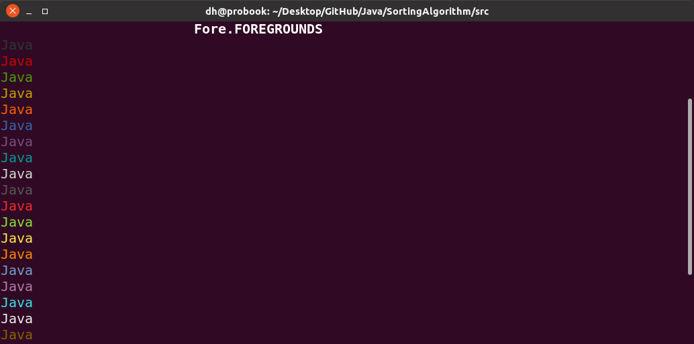
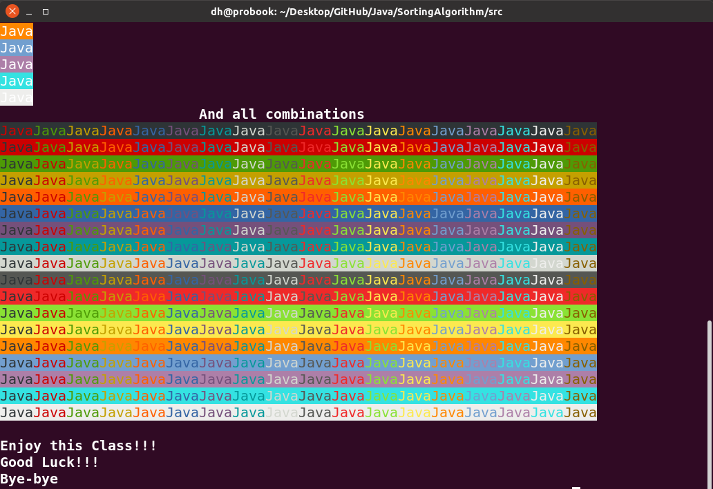

# Installation

1. `javac Colorama.java`
2. `java Colorama`

# Screenshots

# Usage
        println(Fore.BLACK, Fore.BOLD, Back.BRIGHT_GREEN, "Dima Hinev");
        println("set", Fore.CYAN, Fore.BOLD, Back.GREEN, "Permanent text in the SET mode");
        println("In the set mode text doesn't change style");
        println(Fore.RED, "You can change something but the rest remains");
        println("reset", "reset makes default style");
        println("permanently!");
        println("set", Fore.BOLD, Fore.BRIGHT_ORANGE, Back.ORANGE, "for another tips");
        println("resetBack", "you can reset what you want reset[Back, Fore, Bold]");
        println("Also you can put reset or set", "resetFore", " anywhere you want!");
        println("set", Fore.RED, Back.BLACK, "This class provides String array of all available colors for Fore and Back ");
        println("So you can iterate through them... Fore example:");
        println("reset",Fore.BOLD, "\t\t\tFore.FOREGROUNDS", "resetBold");
        for (String f : Fore.FOREGROUNDS) {
            println(f, "Java");
        }
        println(Fore.BOLD, "\t\t\tBack.BACKGROUNDS","resetBold");
        for (String b : Back.BACKGROUNDS) {
            println(b, "Java");
        }
        println(Fore.BOLD, "\t\t\tAnd all combinations", "resetBold");
        int current_back = 0;
        for (String background : Back.BACKGROUNDS) {
            int count2 = 1;
            current_back++;
            for (String foreground : Fore.FOREGROUNDS) {
                if (current_back == count2) {
                    count2++;
                    continue;
                }
                print(background, foreground, "Java");
                count2++;
            }
            System.out.println();
        }
        println("set",Fore.BOLD,"\nEnjoy this Class!!!\nGood Luck!!!\nBye-bye","resetBold");
